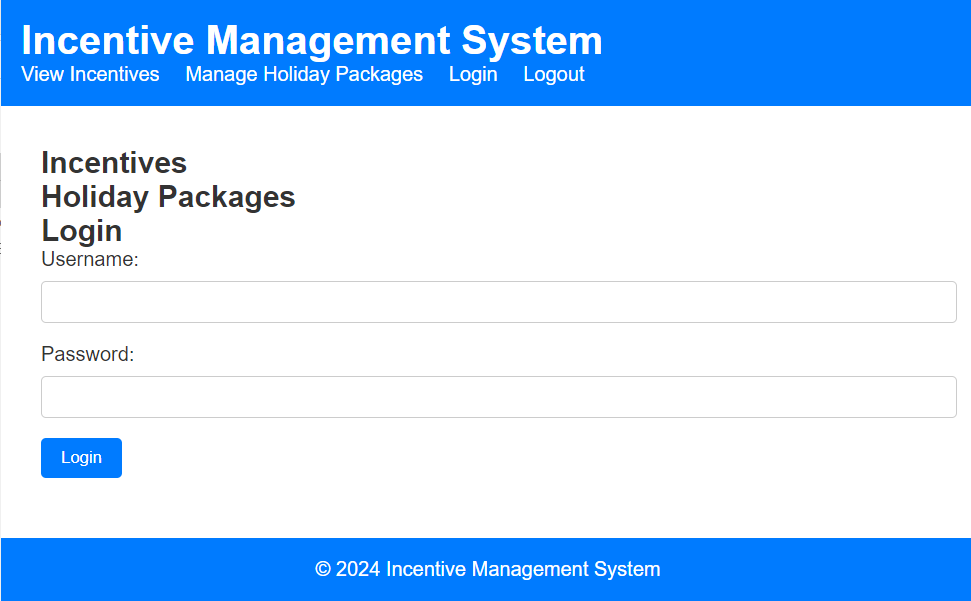

# Incentive Management System

The Incentive Management System is a web-based application developed to automate and streamline the calculation and management of incentives for sales performance in a banking organization. The system provides transparency and efficiency in the incentive calculation process, as well as holiday package management for employees.

## Features

- **Incentive Calculation:** Dynamic calculation of incentives based on predefined sales performance metrics.
- **Holiday Package Management:** Administrative interface for managing holiday packages.
- **Automated Holiday Package Selection:** Integration of holiday package selection logic into the incentive calculation process.
- **Employee Notification System:** Email notification system to inform employees of their performance and incentive details.
- **User Access and Permissions:** User roles and permissions to restrict access to sensitive incentive data.

## Technology Stack

- **Frontend:** HTML, CSS, JavaScript
- **Backend:** Node.js, Express.js
- **Database:** MySQL

## Frontend Image:

## Setup Instructions

1. Clone the project repository from [GitHub link].
2. Install Node.js and MySQL on your system if not already installed.
3. Navigate to the project directory in the terminal.
4. Run `npm install` to install dependencies.
5. Set up MySQL database and configure connection settings in `app.js`.
6. Start the server by running `node app.js`.
7. Access the application in your web browser at `http://localhost:3000`.

## Usage

- **View Incentives:** Navigate to the "View Incentives" section to see the calculated incentives based on sales performance.
- **Manage Holiday Packages:** Access the "Manage Holiday Packages" section to add, edit, or delete holiday packages.
- **Login and Logout:** Use the provided login form to log in to the system. Once logged in, you can view incentives and manage holiday packages.

## Contributing

Contributions are welcome! Please follow the [contribution guidelines](CONTRIBUTING.md) for this project.

## License

This project is licensed under the [License Name] License - see the [LICENSE.md](LICENSE.md) file for details.
